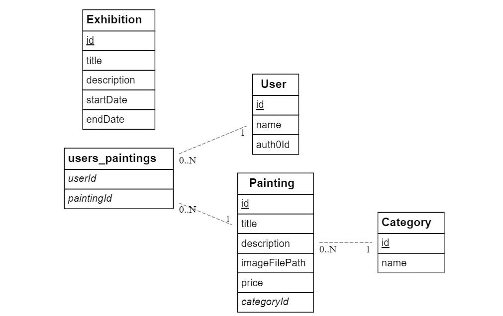
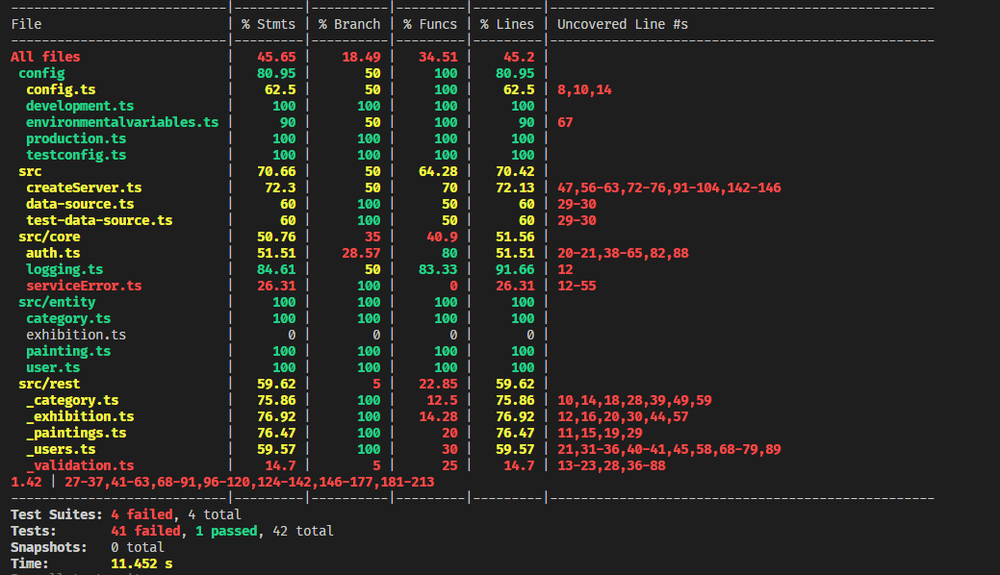

# Ian Daelman (202078391)

- [x] Front-end Web Development
  - [GitHub repository] (https://github.com/Web-IV/2223-frontendweb-iandaelman)
  - [Online versie] (/)
- [x] Web Services: GITHUB URL
  - [GitHub repository] (https://github.com/Web-IV/2223-webservices-iandaelman)
  - [Online versie] (/)

**Logingegevens**

(Admin account met read/write rechten)

- Gebruikersnaam/e-mailadres: ian.daelman@student.hogent.be
- Wachtwoord: Hogent1!

(Gebruiker account zonder rechten)

- Gebruikersnaam/e-mailadres: iandaelman@hotmail.com
- Wachtwoord: Hogent2!

## Projectbeschrijving

Het doel van het project was om een website voor een kuntschilder te maken. Aan de ene kant is er nood aan een mooie frontend om de verschillende kunstwerken te tonen. Aan de andere kant een webservice die een admin de mogelijkheid geeft om aanpassingen te maken aan de site zonder zelf veel technische kennis te hebben.

Een ingelogde gebruiker bepaalde schilderijen aanduiden als favoriet. Voor het overige kan een gebruiker enkel de schilderijen bekijken. Een admin kan de schilderijen aanpassen en tentoonstellingen aankondigen.

De interactiviteit van de site zit vooral bij de admin, een gewone ingelogde gebruiker kan enkel schilderijen aanduiden als favoriet.



Indien de afbeelding niet beschikbaar is kan je onderstaande code gebruiken om de afbeelding te genereren in postman via een POST request naar https://kroki.io/erd/svg met als body de onderstaande code:

```
[User]
*id
name
auth0Id

[Painting]
*id
title
description
imageFilePath
price
+categoryId

[Category]
*id
name

[Exhibition]
*id
title
description
startDate
endDate


[users_paintings]
+userId
+paintingId


Painting *--1 Category
users_paintings *--1 Painting
users_paintings *--1 User

```

## Screenshots

De frontend is onvoldoende uitgewerkt om screenshots te tonen.

## Behaalde minimumvereisten

Voor de front-end gedeelte zijn de minimumvereisten niet behaald.
Daarom zal ik enkel de minimumvereisten voor de webservice aanduiden.

### Front-end Web Development

- **componenten**

  - [ ] heeft meerdere componenten - dom & slim (naast login/register)
  - [ ] definieert constanten (variabelen, functies en componenten) buiten de component
  - [ ] minstens één form met validatie (naast login/register)
  - [ ] login systeem (eigen of extern zoals bv. Auth0)
        <br />

- **routing**

  - [ ] heeft minstens 2 pagina's (naast login/register)
  - [ ] routes worden afgeschermd met authenticatie en autorisatie
        <br />

- **state-management**

  - [ ] meerdere API calls (naast login/register)
  - [ ] degelijke foutmeldingen indien API call faalt
  - [ ] gebruikt useState enkel voor lokale state
  - [ ] gebruikt Context, useReducer, Redux… voor globale state
        <br />

- **hooks**

  - [ ] kent het verschil tussen de hooks (useCallback, useEffect…)
  - [ ] gebruikt de hooks op de juiste manier
        <br />

- **varia**
  - [ ] een aantal niet-triviale testen (unit en/of e2e en/of ui)
  - [ ] minstens één extra technologie
  - [ ] duidelijke en volledige README.md
  - [ ] volledig en tijdig ingediend dossier

### Web Services

- **datalaag**

  - [x] voldoende complex (meer dan één tabel)
  - [x] één module beheert de connectie + connectie wordt gesloten bij sluiten server
  - [x] heeft migraties
  - [x] heeft seeds
        <br />

- **repositorylaag**

  - [x] definieert één repository per entiteit (niet voor tussentabellen) - indien van toepassing
  - [x] mapt OO-rijke data naar relationele tabellen en vice versa
        <br />

- **servicelaag met een zekere complexiteit**

  - [x] bevat alle domeinlogica
  - [x] bevat geen SQL-queries of databank-gerelateerde code
        <br />

- **REST-laag**

  - [x] meerdere routes met invoervalidatie
  - [x] degelijke foutboodschappen
  - [x] volgt de conventies van een RESTful API
  - [x] bevat geen domeinlogica
  - [x] degelijke authorisatie/authenticatie op alle routes
        <br />

- **varia**
  - [x] een aantal niet-triviale testen (min. 1 controller >=80% coverage)
  - [x] minstens één extra technologie
  - [x] duidelijke en volledige `README.md`
  - [x] maakt gebruik van de laatste ES6-features (object destructuring, spread operator...)
  - [x] volledig en tijdig ingediend dossier

## Projectstructuur

### Front-end Web Development

- Niet van toepassing

### Web Services

In de src map heb ik gebruik gemaakt van een core map waarin de auth, logging en serviceError staan. Daarnaast is er een entity map waar de verschillende entiteiten staan die nodig zijn voor het aanmaken van de tabellen in de databank. De map migrations bevat de migraties die nodig zijn om de tabellen aan te maken. Hierin staan ook de bestanden om de seeding uit te voeren.

Dan hebben we de rest en service map. In de rest map staan de bestanden die verder de services gaan aanspreken. Vooraleer ze de service aanspreken gaan ze eerst de authenticatie en autorisatie controleren met de token van auth0. Daarna volgt de validatie van de input.

In de bestanden van de service map gaan we verder met het aanspreken van de repository. Vanuit deze laag geven we dan ofwel het resultaat of een error terug met de correcte statuscode en foutboodschap.

Buiten de src folder hebben we een config map. Hierin staan de bestanden die de configuratie van de databank, logging en auth0 regelen.
Daarnaast is er ook een test map waarin de verschillende testen staan. Per entiteit is een bestand aangemaakt met daarin de testen voor de endpoints van die entiteit.

## Extra technologie

### Front-end Web Development

- Niet van toepassing

### Web Services

- TypeORM [https://www.npmjs.com/package/typeorm]
- Typescript [https://www.npmjs.com/package/typescript]

## Testresultaten

### Front-end Web Development

- Niet van toepassing

### Web Services

Ik heb tijdens dit project proberen te werken met jest/superjest om testen te schrijven. Dit zorgde echter voor heel wat problemen. De testen die ik heb geschreven werken niet door een probleem die volgt uit het gebruik van TypeORM.
Ik heb onvoldoende tijd gehad om een oplossing of alternatief te vinden voor dit probleem. Ik heb wel voor de verschillende endpoints testen geschreven, ze kunnen enkel niet gebruikt worden om de toepassing echt te gaan testen. Hieronder zie je een afbeelding van de test coverage.



## Gekende bugs

### Front-end Web Development

- Niet van toepassing

### Web Services

- De testen werken niet door een probleem die volgt uit het gebruik van TypeORM.
- Wanneer je de webservice wilt afsluiten moet je 2x op y doorgeven.

## Wat is er verbeterd/aangepast?

### Front-end Web Development

- Niet van toepassing

### Web Services

- Opnieuw gestart met Typeorm en Typescript. Doordat het project lang is blijven liggen door het project in het tweede semester ben ik van scratch begonnen met werken. TypeORM is naar mijn aanvoelen gemakkelijk om te gebruiken maar zorgt wel voor heel wat problemen wanneer je de toepassing wilt testen.
